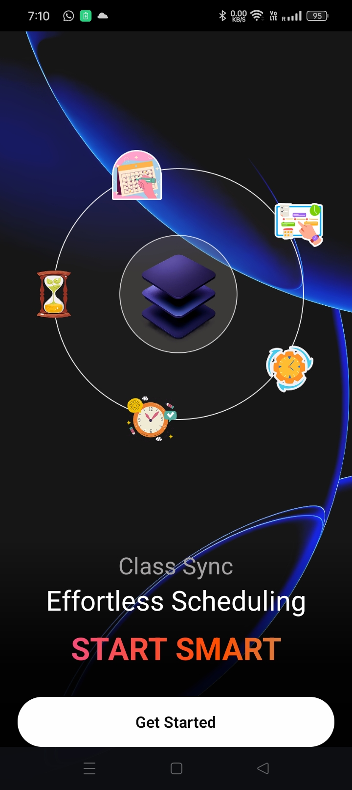
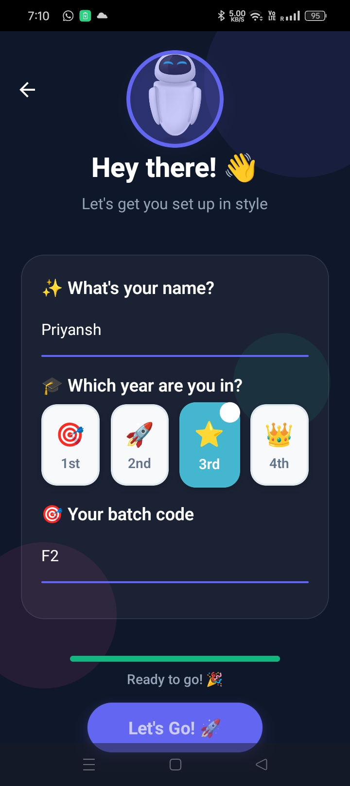
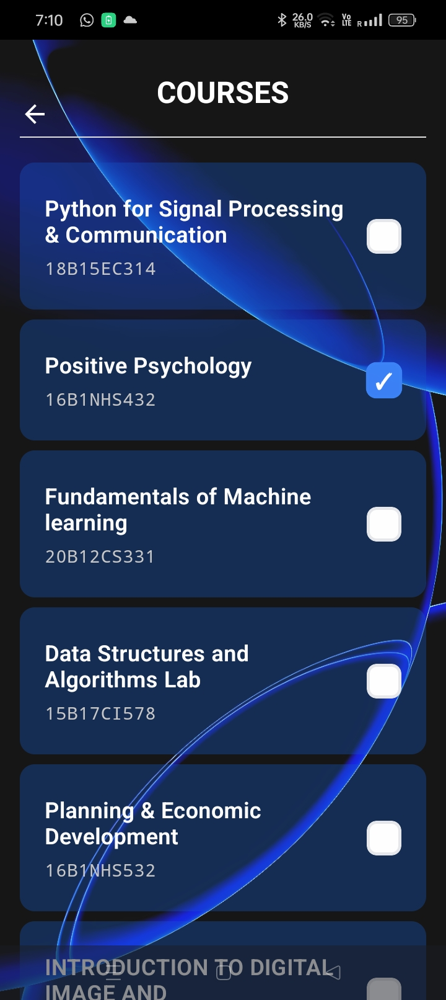
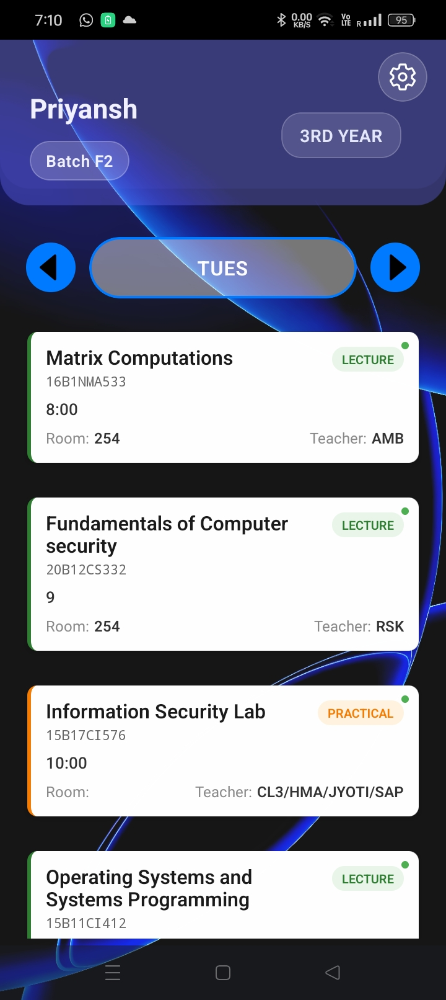

# ClassSync 📚⏰

A comprehensive class scheduling and timetable management system built with React Native, React, and Rust. ClassSync provides an intuitive mobile app for students to manage their schedules, an admin dashboard for timetable management, and a robust backend API for data processing and storage.

## 🚀 Features

### Mobile App (React Native)
- **Smart Schedule Management**: View and manage your class timetable with an intuitive interface
- **Personalized Experience**: Customize your schedule preferences and settings
- **Modern UI/UX**: Beautiful gradient designs and smooth animations

### Admin Dashboard (React)
- **MetaData Management**: Configure and manage timetable metadata
- **TimeTable Editor**: Visual timetable creation and editing interface
- **Real-time Updates**: Instant synchronization with the backend
- **Responsive Design**: Works seamlessly on desktop and tablet devices

### Backend API (Rust)
- **PDF Processing**: Extract timetable data from PDF documents using AI
- **MongoDB Integration**: Robust data storage and retrieval
- **RESTful API**: Clean and efficient API endpoints
- **CORS Support**: Cross-origin resource sharing enabled
- **Error Handling**: Comprehensive error management and logging

## 🏗️ Architecture

```
ClassSync/
├── App/                 # React Native Mobile Application
├── admin/              # React Admin Dashboard
└── backend/            # Rust Backend API
```

## 🛠️ Tech Stack

### Mobile App
- **Framework**: React Native with Expo
- **Navigation**: Expo Router
- **UI Components**: Custom components with React Native
- **Storage**: AsyncStorage for local data persistence
- **Styling**: StyleSheet with gradient effects
- **Icons**: Expo Vector Icons

### Admin Dashboard
- **Framework**: React 19 with Vite
- **Styling**: Tailwind CSS 4
- **Icons**: Lucide React
- **Build Tool**: Vite
- **Linting**: ESLint

### Backend API
- **Language**: Rust
- **Framework**: Axum web framework
- **Database**: MongoDB
- **AI Processing**: Gemini Light for PDF extraction
- **Authentication**: bcrypt for password hashing
- **CORS**: Tower HTTP CORS middleware

## 📱 Mobile App Screenshots

The mobile app features:
- **Welcome Screen**: Beautiful gradient background with hero image
- **Personalization**: User preference setup
- **Timetable View**: Interactive schedule display
- **Course Management**: Add and manage courses

### App Screenshots


<div align="center">
  
  <p><em>Welcome Screen - Beautiful gradient design with hero image</em></p>
</div>

<div align="center">
  
  <p><em>Personalization Screen - User preference setup</em></p>
</div>

<div align="center">
  
  <p><em>Course Management - Add and manage courses </em></p>
</div>

<div align="center">
  
  <p><em>Timetable View - Interactive schedule display</em></p>
</div>

## 🖥️ Admin Dashboard Features

<div align="center">
  
  <p><em>Built with React 19 & Vite</em></p>
</div>

- **MetaData Tab**: Configure timetable metadata and settings
- **TimeTable Tab**: Visual timetable editor with drag-and-drop functionality
- **Real-time Sync**: Instant updates between admin and mobile app

## 🔧 Installation & Setup

### Prerequisites
- Node.js (v18 or higher)
- Rust (latest stable)
- MongoDB (local or cloud instance)
- Expo CLI (for mobile development)

### Backend Setup

1. **Navigate to backend directory**:
   ```bash
   cd backend
   ```

2. **Install Rust dependencies**:
   ```bash
   cargo build
   ```

3. **Set up environment variables**:
   Create a `.env` file in the backend directory:
   ```env
   MONGODB_URI=your_mongodb_connection_string
   GEMINI_API_KEY=your_gemini_api_key
   ```

4. **Run the backend server**:
   ```bash
   cargo run
   ```
   The server will start on `http://localhost:3000`

### Admin Dashboard Setup

1. **Navigate to admin directory**:
   ```bash
   cd admin
   ```

2. **Install dependencies**:
   ```bash
   npm install
   ```

3. **Start development server**:
   ```bash
   npm run dev
   ```
   The dashboard will be available at `http://localhost:5173`

### Mobile App Setup

1. **Navigate to App directory**:
   ```bash
   cd App
   ```

2. **Install dependencies**:
   ```bash
   npm install
   ```

3. **Start Expo development server**:
   ```bash
   npm expo start
   ```

4. **Run on device/simulator**:
   - Press `a` for Android
   - Press `i` for iOS
   - Scan QR code with Expo Go app

## 📡 API Endpoints

### Base URL: `http://localhost:3000`

| Method | Endpoint | Description |
|--------|----------|-------------|
| GET | `/new` | Health check endpoint |
| POST | `/metadata` | Set timetable metadata |
| GET | `/metadata` | Retrieve timetable metadata |
| POST | `/timetable` | Set timetable data |
| GET | `/timetable` | Retrieve timetable data |
| GET | `/ext/timetable` | Fetch and process timetable |

## 🔄 Data Flow

1. **PDF Upload**: Admin uploads timetable PDF through the dashboard
2. **AI Processing**: Backend uses Gemini AI to extract timetable data
3. **Data Storage**: Processed data is stored in MongoDB
4. **Mobile Sync**: Mobile app fetches and displays the timetable
5. **Real-time Updates**: Changes are synchronized across all platforms

## 🎨 UI/UX Features

- **Gradient Backgrounds**: Modern gradient designs throughout the app
- **Smooth Animations**: React Native Reanimated for fluid interactions
- **Responsive Design**: Adapts to different screen sizes
- **Dark/Light Themes**: Consistent theming across components
- **Loading States**: Elegant loading indicators and transitions

## 🔒 Security Features

- **Password Hashing**: bcrypt for secure password storage
- **CORS Protection**: Proper CORS configuration for API access
- **Input Validation**: Comprehensive data validation on all endpoints
- **Error Handling**: Secure error responses without sensitive data exposure

## 🚀 Deployment

### Backend Deployment
- Build with `cargo build --release`
- Deploy to cloud platforms (AWS, Google Cloud, etc.)
- Set up MongoDB Atlas for database hosting

### Admin Dashboard Deployment
- Build with `npm run build`
- Deploy to Vercel, Netlify, or similar platforms

### Mobile App Deployment
- Build with `expo build`
- Submit to App Store and Google Play Store
- Use EAS Build for production builds

## 🤝 Contributing

1. Fork the repository
2. Create a feature branch (`git checkout -b feature/amazing-feature`)
3. Commit your changes (`git commit -m 'Add some amazing feature'`)
4. Push to the branch (`git push origin feature/amazing-feature`)
5. Open a Pull Request

## 📝 License

This project is licensed under the MIT License - see the [LICENSE](LICENSE) file for details.

## 🆘 Support

For support and questions:
- Create an issue in the GitHub repository
- Check the documentation in each component's directory
- Review the API documentation for backend integration

## 🔮 Future Enhancements

- [ ] Push notifications for class reminders
- [ ] Calendar integration (Google Calendar, Outlook)
- [ ] Multi-language support
- [ ] Advanced analytics and reporting
- [ ] Student attendance tracking
- [ ] Integration with learning management systems

---

**ClassSync** - Making class scheduling effortless and intelligent! 📚✨ 
